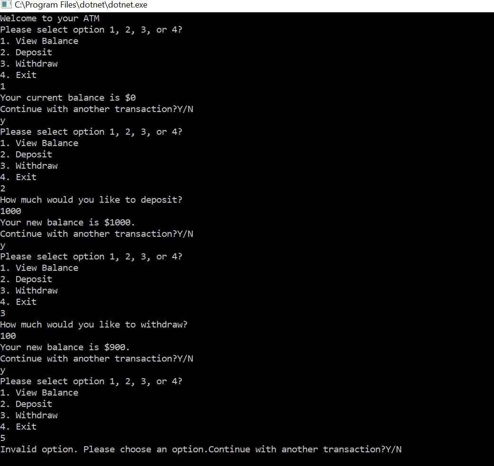

# Lab02-UnitTesting

# Overview

Creates a bank “ATM” machine within a console application with VS2017

# Visuals

# How to use

Download and build/run the program in Visual Studio. It should open a Console application. Use TDD to add new methods.

## Other

Tests are provided to test functionality of ATM such as to:
- make a deposit
- make withdrawal
- view balance
- update balance
